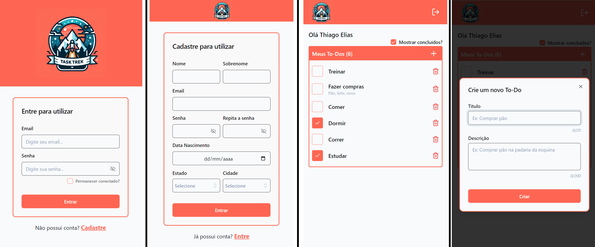

<h1 align="center">Task Trek</h1> 

<p align="center">
<a href="https://vitejs.dev/">
  
</a>
<a href="https://reactjs.org/">
  
</a>
<a href="https://www.typescriptlang.org">

</a>
<a href="https://tailwindcss.com/">
  
</a>
<a href="https://github.com/colinhacks/zod">
  
</a>
<a href="https://github.com/colinhacks/zod">
  
</a>
<a href="https://www.netlify.com/">
  
</a>
</p>

 ## **Descrição do projeto**

- Projeto desenvolvido com o framework [***Vite.js***](https://vitejs.dev/), utilizando [***React***](https://react.dev/) e [***TypeScript***](https://www.typescriptlang.org/) para a matéria de Interfaces com React, da [***Pós-Graduação em Desenvolvimento Web Full Stack***](https://posgraduacao.infnet.edu.br/ead/pos-graduacao-desenvolvimento-web-full-stack/) da [***Infnet***](https://www.infnet.edu.br/infnet/home/).

- O projeto consiste de um web app de lista de tarefas com nome fictício de [***Task Trek***](https://main--telias-todo.netlify.app). Possui formulários de login/registro e a tela principal do app onde são inseridos e alterado as tarefas. As tarefas são separadas por usuário

- Utiliza uma [***API Rest***](https://github.com/thiagoelias99/nest-template-todo) para cadastro | autenticação de usuários e gerenciamento dos dados.

- Autenticação utilizando Token JWT.

- Layout responsivo criado com metodologia ***mobile-first*** utilizando [***TailwindCSS***](https://tailwindcss.com/)

- Utiliza pipeline de deploy automático na [***Netlify***](https://www.netlify.com/) em conjunto com o [***GitHub***](https://github.com/)

## **Deploy da aplicação**
[Link do Task Trek no Netlify](https://main--telias-todo.netlify.app)
- ***Importante:*** O servidor onde está hospedado a Api Rest mantém o backend suspenso quando há um período de inatividade.
- Pode levar até um minuto para o servidor iniciar a Api e começar a responder as solicitações.

<p align="center">

</p>

## **Instalação do Projeto**
### **Projeto desenvolvido com Vite.js versão 5.**

### **Requerimentos**
- Instalação do [***Node.js***](https://nodejs.org/en)

### **Instalação das dependências**
```bash
npm install
```

### **Configuração das variáveis de ambiente**
- Renomear o arquivo ***env.example*** para ***env.local*** e preencher a informação do endpoint da API.

### **Executar servidor de desenvolvimento**
```bash
npm run dev 
```

### Inspirations
- [Todo](https://www.figma.com/community/file/1287029163993360080/simple-todo-list-design?searchSessionId=ls3vp8xq-j4s3l7yh8el)
- [Login](https://www.figma.com/community/file/1098926234598800271/simple-dashboard-login-page?searchSessionId=ls3w1tup-kw6l8uff4w)